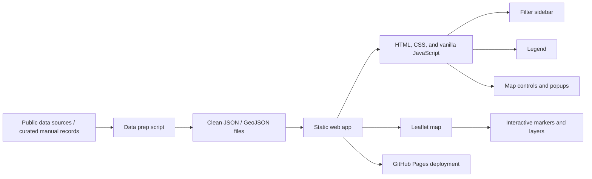

# Product Requirements Document (PRD)

# Texas Natural Resource Atlas

**Project type:** AI-assisted software development project  
**Product format:** Interactive web application  
**Region:** Texas  
**Primary interface:** Interactive map  
**Prepared for:** CS 2308 Extra Credit Project — AI-Assisted Development  
**Prepared by:** `[Your Name]`  
**Version:** 1.0  
**Date:** April 26, 2026

---

## Document Purpose

This PRD defines the scope, architecture, technical stack, product requirements, data model, implementation plan, and grading-aligned success criteria for the **Texas Natural Resource Atlas** project.

The goal is to keep the project ambitious enough to demonstrate real software development skills, but narrow enough to finish within the course's 40-hour human work limit.

---

## Table of Contents

1. [Executive Summary](#1-executive-summary)
2. [Assignment Alignment and Constraints](#2-assignment-alignment-and-constraints)
3. [Product Vision](#3-product-vision)
4. [Problem Statement](#4-problem-statement)
5. [Goals, Non-Goals, and Success Metrics](#5-goals-non-goals-and-success-metrics)
6. [Target Users and Use Cases](#6-target-users-and-use-cases)
7. [MVP Scope and Stretch Scope](#7-mvp-scope-and-stretch-scope)
8. [Functional Requirements](#8-functional-requirements)
9. [User Experience and Interface Requirements](#9-user-experience-and-interface-requirements)
10. [Data Model and Content Specification](#10-data-model-and-content-specification)
11. [Architecture](#11-architecture)
12. [Technology Stack](#12-technology-stack)
13. [Repository Structure](#13-repository-structure)
14. [Environment Setup](#14-environment-setup)
15. [Data Ingestion and Update Workflow](#15-data-ingestion-and-update-workflow)
16. [Risks, Assumptions, and Mitigations](#16-risks-assumptions-and-mitigations)
17. [Project Plan and 40-Hour Time Budget](#17-project-plan-and-40-hour-time-budget)
18. [Acceptance Criteria](#18-acceptance-criteria)
19. [Testing Plan](#19-testing-plan)
20. [Demo Plan and Presentation Guidance](#20-demo-plan-and-presentation-guidance)
21. [Deliverables Checklist](#21-deliverables-checklist)
22. [Suggested Grading Rubric](#22-suggested-grading-rubric)
23. [AI Usage Plan](#23-ai-usage-plan)
24. [Example README Run Instructions](#24-example-readme-run-instructions)

---

## 1. Executive Summary

**Texas Natural Resource Atlas** is a browser-based interactive map application that helps users explore natural resource information across Texas.

The app will show selected natural resource data through three map-oriented information layers:

1. **Known or discovered deposits**
2. **Active production sites**
3. **Extraction, processing, or support facilities**

The project will focus on a limited but useful MVP: Texas-only coverage, a small number of resource categories, curated static datasets, and a clean interactive map interface.

The recommended implementation is a **static single-page web application**. This means the project does not require a live backend, user accounts, authentication, or a production database. Instead, the app loads prepared JSON and GeoJSON data files directly in the browser.

This architecture is intentional. It keeps the project explainable, demo-friendly, and realistic for a student project with a fixed human effort budget.

---

## 2. Assignment Alignment and Constraints

This project is designed around the course's extra-credit project structure.

The project must:

- Be self-directed.
- Use AI tools as development aids.
- Stay within a 40-hour human work limit.
- Include a proposal presentation.
- Include final documentation.
- Include source code.
- Include a final PowerPoint presentation.
- Include grading criteria created by the student.
- Be understandable enough that the student can explain every major implementation decision.

Because of those constraints, this PRD prioritizes:

- A limited MVP scope.
- Clear architecture.
- Simple deployment.
- Explainable code.
- A clean demo path.
- Strong documentation.

The project should not attempt to become a full professional GIS platform. It should instead demonstrate a well-scoped, polished, interactive data visualization product.

---

## 3. Product Vision

The product vision is to build a clean, interactive Texas-focused atlas that makes geographically distributed natural resource information easier to understand.

A user should be able to open the website, select a resource type such as **oil**, **natural gas**, or **lithium**, and immediately see where related sites are located. The user should then be able to click a point on the map and view useful details such as site name, site type, county, operator, status, and source information.

The final result should feel like a lightweight educational GIS tool.

---

## 4. Problem Statement

Natural resource information is often scattered across government reports, company pages, energy databases, PDF documents, and static tables. Even when the information is public, it can be difficult to understand geographically.

The Texas Natural Resource Atlas solves this by presenting selected resource data visually on a map.

Instead of reading disconnected records, users can explore:

- Where resources are located.
- Which areas are associated with production.
- Where facilities are concentrated.
- How different resource categories compare geographically.

The project demonstrates how software, mapping libraries, structured data, and AI-assisted development can be combined into a useful interactive application.

---

## 5. Goals, Non-Goals, and Success Metrics

### 5.1 Goals

The project should accomplish the following:

- Provide a map-based way to explore natural resource information in Texas.
- Show at least three distinct site categories:
  - Deposits
  - Production sites
  - Facilities
- Allow filtering by resource type.
- Allow filtering by site type.
- Display structured details for each mapped location.
- Use a clean and understandable architecture.
- Be realistic to finish within 40 hours.
- Be easy to demonstrate in a 5–10 minute presentation.

### 5.2 Non-Goals

The MVP will not include:

- Global or nationwide coverage.
- Real-time data feeds.
- User accounts or authentication.
- User-generated data submissions.
- A production database.
- A custom backend API.
- Advanced geospatial analytics.
- Automatic web scraping.
- Full historical trend analysis.

These features could be future enhancements, but they are out of scope for the course MVP.

### 5.3 Success Metrics

| Metric | Target |
|---|---|
| MVP feature completeness | Core filters, legend, markers, and detail views work correctly. |
| Data coverage | At least three resource categories and three site types are represented. |
| Presentation readiness | A short live demo can show the main user flow without broken features. |
| Code maintainability | The code is organized into clear components and data files. |
| Documentation quality | README, PRD, time log, and grading criteria are clear. |
| Time discipline | Human effort remains at or below 40 hours. |

---

## 6. Target Users and Use Cases

### 6.1 Primary Users

The primary users are:

- The instructor evaluating the project.
- Classmates watching the proposal and final presentation.
- General users interested in understanding natural resource activity in Texas.

### 6.2 User Stories

| ID | User Story |
|---|---|
| US-1 | As a user, I want to see natural resource locations on a map so I can understand their geographic distribution. |
| US-2 | As a user, I want to filter by resource type so I can focus on oil, natural gas, lithium, or another selected category. |
| US-3 | As a user, I want to filter by site type so I can distinguish deposits from production sites and facilities. |
| US-4 | As a user, I want to click a marker and read a short site profile with location, status, operator, and production-related data. |
| US-5 | As a user, I want a simple interface so I can understand the app in under one minute. |
| US-6 | As an evaluator, I want the student to explain the code, data model, and AI usage clearly. |

---

## 7. MVP Scope and Stretch Scope

### 7.1 MVP Scope

The MVP should include:

- Texas-only map coverage.
- Three initial resource categories:
  - Oil
  - Natural gas
  - Lithium
- Three initial site types:
  - Deposits
  - Production sites
  - Processing or extraction facilities
- Interactive map with pan and zoom.
- Sidebar filters for resource type and site type.
- Clickable map markers.
- Popup or side-panel details for selected sites.
- Legend explaining symbols or colors.
- Source attribution area.
- README with setup instructions.
- Basic time log for project documentation.

### 7.2 Stretch Scope

Stretch features should only be attempted after the MVP works.

Possible stretch features:

- Search by site name or county.
- Summary cards showing counts of visible sites.
- County-level overlay.
- Timeline or date filter.
- Comparison mode for two selected sites.
- Improved responsive mobile layout.
- Deployment to GitHub Pages or Vercel.

### 7.3 Scope Control Rule

The map must work smoothly with curated sample data before any stretch feature is attempted.

If time becomes constrained, reduce scope by:

- Limiting the number of data records.
- Removing stretch features.
- Simplifying visual styling.
- Using manually curated datasets instead of complex ingestion.

Do not reduce scope by leaving the core map broken.

---

## 8. Functional Requirements

| ID | Requirement | Priority | Acceptance Condition |
|---|---|---|---|
| FR-1 | The system loads a base map of Texas in the browser. | Must | The map is visible on first page load. |
| FR-2 | The system plots location markers from prepared dataset files. | Must | At least one dataset renders correctly on the map. |
| FR-3 | The user can filter by resource category. | Must | Visible map points update when a category is selected. |
| FR-4 | The user can filter by site type. | Must | Visible map points update when a site type is selected. |
| FR-5 | The user can click a site and open a detail view. | Must | A detail card or popup displays structured data. |
| FR-6 | The system shows a legend that explains symbols or colors. | Must | The legend matches the map encoding. |
| FR-7 | The system provides data source or attribution text. | Should | Source information is visible in the UI or footer. |
| FR-8 | The system supports search by name or location. | Could | Search narrows visible results. |
| FR-9 | The system remains usable on a laptop browser resolution. | Must | No major overlap or clipped content on a standard laptop display. |
| FR-10 | The project includes local run instructions. | Must | A user can follow the README and run the app locally. |

---

## 9. User Experience and Interface Requirements

The interface should be intentionally minimal. The goal is to demonstrate functionality clearly rather than overwhelm the user with too many controls.

### 9.1 Main Layout

The recommended UI layout includes:

- Header with project title and short description.
- Left sidebar with filters and optional search.
- Large central map area.
- Legend in the sidebar or map corner.
- Popup or side-panel detail card.
- Footer or small text area for source attribution.

### 9.2 Main Screens

The app can be implemented as a single page with the following areas:

| Area | Purpose |
|---|---|
| Header | Identifies the project and gives a short explanation. |
| Sidebar | Provides resource filters, site type filters, and optional search. |
| Map Area | Displays Texas map, markers, and layers. |
| Detail View | Shows information about the selected site. |
| Legend | Explains colors, icons, or symbols. |
| Attribution | Lists data sources and map tile attribution. |

### 9.3 Visual Design Principles

The visual design should use:

- Clear typography.
- Consistent spacing.
- Limited color palette.
- Distinct marker styles for categories.
- Enough whitespace to keep the interface readable.
- Simple icons or labels.
- No unnecessary animations.

---

## 10. Data Model and Content Specification

### 10.1 Core Entity

The core data entity is a **geospatial site record**. Each record represents one mapped location.

| Field | Type | Required | Description |
|---|---|---|---|
| `id` | string | Yes | Unique stable identifier for the site. |
| `name` | string | Yes | Display name of the site. |
| `resourceType` | enum | Yes | Example values: `oil`, `naturalGas`, `lithium`. |
| `siteType` | enum | Yes | Example values: `deposit`, `production`, `facility`. |
| `latitude` | number | Yes | Decimal latitude. |
| `longitude` | number | Yes | Decimal longitude. |
| `county` | string | No | County or regional label. |
| `status` | string | No | Example values: active, inactive, planned, historical, unknown. |
| `operator` | string | No | Owning or operating company. |
| `facilityType` | string | No | Refinery, processing plant, extraction facility, etc. |
| `estimatedReserve` | string or number | No | Reserve estimate if available. |
| `annualProduction` | string or number | No | Production amount if available. |
| `description` | string | No | Human-readable summary. |
| `sourceName` | string | No | Original data source name. |
| `sourceUrl` | string | No | Reference URL for the record. |
| `lastUpdated` | string | No | Date the record was last checked or updated. |

### 10.2 Example JSON Record

```json
{
  "id": "tx-oil-001",
  "name": "Example Permian Basin Production Site",
  "resourceType": "oil",
  "siteType": "production",
  "latitude": 31.8457,
  "longitude": -102.3676,
  "county": "Ector County",
  "status": "active",
  "operator": "Example Operator",
  "facilityType": "production site",
  "estimatedReserve": null,
  "annualProduction": "sample value",
  "description": "Sample production location used for the MVP dataset.",
  "sourceName": "Curated sample dataset",
  "sourceUrl": "",
  "lastUpdated": "2026-04-26"
}
```

### 10.3 Recommended File Formats

| File Type | Purpose |
|---|---|
| GeoJSON | Best for map points, polygons, and feature properties. |
| JSON | Good for configuration, metadata, and lookup values. |
| CSV | Useful as a temporary data-cleaning input format. |

### 10.4 Dataset Strategy

The project should use a curated dataset rather than trying to include every possible natural resource site in Texas.

Recommended dataset target:

- 10–20 oil or gas production-related points.
- 5–10 lithium or mineral-related points.
- 5–10 facility points.

This is enough to demonstrate the software without making data collection the entire project.

---

## 11. Architecture

The recommended architecture is a **static single-page application** backed by curated dataset files committed to the repository.

This gives the best balance between professionalism and feasibility.

### 11.1 Architecture Diagram



### 11.2 Architectural Style

The MVP uses:

- Client-side rendering in the browser.
- Static hosting.
- Prepared data files loaded at runtime.
- No backend server.
- No production database.
- Optional Python scripts for data normalization before deployment.

### 11.3 Why This Architecture Fits

This architecture is appropriate because it:

- Reduces setup complexity.
- Eliminates backend deployment problems.
- Keeps debugging focused on frontend logic and data quality.
- Makes the project easier to explain.
- Allows simple deployment through GitHub Pages or Vercel.
- Keeps the final submission portable.

### 11.4 Future Architecture Path

If expanded after the course, the app could add:

- A backend API.
- A spatial database such as PostGIS.
- Automated data ingestion jobs.
- Historical production data.
- User accounts.
- Advanced charts and analytics.

These are explicitly outside the MVP scope.

---

## 12. Technology Stack

### 12.1 Recommended Stack

| Layer | Technology | Role | Reason for Choice |
|---|---|---|---|
| Frontend | HTML + CSS + vanilla JavaScript | Build the interactive single-page web app. | Simple static files, no build step, and easy GitHub Pages deployment. |
| Mapping | Leaflet | Render maps, markers, popups, and layers. | Lightweight, popular, well-documented, ideal for student GIS-style apps. |
| Styling | Plain CSS | Layout and component styling. | Keeps styling simple while allowing a polished interface. |
| Data assets | GeoJSON + JSON | Store map features and metadata. | Transparent, Git-friendly, easy to inspect and load in the browser. |
| Data prep | Manual curation or optional scripts | Normalize raw data into app-ready files. | Keeps the MVP lightweight while allowing repeatable cleanup if needed. |
| Version control | Git + GitHub | Track source code and project history. | Standard professional workflow. |
| Hosting | GitHub Pages or Vercel | Deploy the finished static app. | Free and appropriate for demos. |
| Documentation | Markdown | README, PRD, setup notes, grading criteria, time log. | Easy to edit, version-control, and submit. |
| AI tools | ChatGPT and optionally GitHub Copilot | Planning, coding help, debugging, documentation drafting. | Directly aligned with the assignment. |

### 12.2 Static MVP Stack

- HTML
- CSS
- Vanilla JavaScript
- Leaflet
- JSON or GeoJSON data files

The project uses this static stack for the MVP.

This fallback should be used if framework setup begins to threaten the 40-hour limit.

---

## 13. Repository Structure

Recommended repository layout:

```text
texas-natural-resource-atlas/
├── assets/
│   └── texas-flag.svg
├── data/
│   ├── resources.geojson
│   ├── sourceRegistry.json
│   ├── texas_resource_regions_basins.geojson
│   └── texas_border.geojson
├── docs/
│   ├── DATA_SOURCES.md
│   └── Texas_Natural_Resource_Atlas_PRD.md
├── README.md
├── index.html
├── styles.css
└── app.js
```

---

## 14. Environment Setup

### 14.1 Required Tools

The development environment should include:

- Git.
- A modern browser such as Chrome, Edge, or Firefox.
- Python 3 for running a local static server.
- Optional: Node.js for syntax checks or data validation scripts.

### 14.2 Setup Steps

```bash
# Enter the project folder
cd texas-natural-resource-atlas

# Start a local static server
python3 -m http.server 8000
```

### 14.3 Expected Local Behavior

After setup, the app should:

1. Open in a local browser.
2. Display a Texas-centered map.
3. Load local data files from `data/`.
4. Render markers, resource regions, and the Texas border layer.
5. Allow filter interaction.
6. Show popup information when a marker or region is clicked.

---

## 15. Data Ingestion and Update Workflow

The MVP should use a manual or semi-manual data workflow.

### 15.1 Data Workflow

1. Collect raw data from selected public sources or curated references.
2. Save the raw data as CSV, JSON, or manually edited records.
3. Normalize field names and coordinate formats.
4. Validate required fields.
5. Export app-ready GeoJSON or JSON.
6. Place prepared files in `data/`.
7. Load the files in the frontend.
8. Test marker rendering and filters.
9. Commit both source data and processed data to GitHub.

### 15.2 Data Validation Rules

Every displayable record must have:

- `id`
- `name`
- `resourceType`
- `siteType`
- `latitude`
- `longitude`

Coordinates should be checked to ensure they fall within or near Texas.

Approximate Texas coordinate ranges:

- Latitude: about `25` to `37`
- Longitude: about `-107` to `-93`

### 15.3 Manual Updates Are Acceptable

The MVP does not require live updating. Manual refreshes are acceptable because they:

- Reduce hidden complexity.
- Make the dataset easier to verify.
- Keep the project explainable.
- Fit the time limit better than automated scraping or APIs.

---

## 16. Risks, Assumptions, and Mitigations

| Risk | Likelihood | Impact | Mitigation |
|---|---:|---:|---|
| Finding clean location data for every site is difficult. | Medium | High | Use a smaller curated dataset and prioritize quality over quantity. |
| Scope creep from adding too many resources or features. | High | High | Freeze MVP scope early and treat stretch items as optional. |
| Frontend mapping bugs or UI clutter. | Medium | Medium | Keep layout simple and test after each feature addition. |
| Time overrun near deadline. | Medium | High | Reserve explicit time for testing, documentation, and presentation prep. |
| AI-generated code is not fully understood. | Low | High | Review every feature and keep code intentionally simple. |
| Data sources have inconsistent terminology. | Medium | Medium | Normalize data into a controlled set of categories. |
| Deployment takes longer than expected. | Medium | Medium | Keep local run instructions as the primary acceptance path; treat hosting as a bonus. |

---

## 17. Project Plan and 40-Hour Time Budget

| Workstream | Estimated Hours | Notes |
|---|---:|---|
| Planning, PRD, and proposal preparation | 4 | Finalize project scope, architecture, and presentation direction. |
| Dataset research and curation | 8 | Select sources and prepare a small but useful sample dataset. |
| Data normalization scripts | 4 | Convert raw data into consistent JSON or GeoJSON. |
| Frontend scaffolding | 5 | Set up static HTML, CSS, vanilla JavaScript, Leaflet, and base layout. |
| Map implementation | 7 | Add Leaflet map, markers, popups, and map layers. |
| Filtering and map UI | 5 | Build sidebar filters, overlay toggle, legend, and map popups. |
| Testing and bug fixing | 4 | Check data loading, UI interactions, and map behavior. |
| Documentation and final presentation | 3 | Prepare README, time log, final slides, and grading criteria. |
| **Total** | **40** | Target stays within assignment limit. |

### 17.1 Suggested Milestones

| Milestone | Description | Target Outcome |
|---|---|---|
| M1 | Proposal-ready scope | Project idea, stack, and grading criteria are defined. |
| M2 | Data model complete | Sample records exist and are formatted consistently. |
| M3 | Base app running | Local app runs with a Texas-centered map. |
| M4 | Data displayed | Markers appear from local data files. |
| M5 | Filters working | User can filter by resource and site type. |
| M6 | Demo-ready app | Project can be shown in a final presentation. |
| M7 | Submission package complete | Source code, documentation, time log, slides, and rubric are ready. |

---

## 18. Acceptance Criteria

The project is considered complete when:

- The application opens locally without runtime errors.
- The app displays a Texas-centered map.
- At least three resource categories are represented.
- At least three site types are represented.
- Map markers are visibly distinguishable.
- Filters update the visible map results correctly.
- Clicking a marker displays useful metadata.
- A legend explains the map symbols or colors.
- The project includes a README with run instructions.
- The project includes a time log.
- The project includes grading criteria.
- The student can explain the architecture, code structure, AI usage, and tradeoffs.

---

## 19. Testing Plan

| Test Area | Approach | Expected Result |
|---|---|---|
| Data validation | Check required fields, coordinate ranges, and category values before importing. | Invalid records are fixed or removed. |
| Map loading | Open the app locally and verify that the map appears. | The map loads without console errors. |
| Marker rendering | Load each dataset and inspect marker positions. | Markers appear in expected Texas locations. |
| Filters | Toggle each resource and site type filter. | Visible markers update correctly. |
| Detail view | Click multiple markers. | Correct record details appear. |
| Legend | Compare marker styles to legend labels. | Legend accurately describes the map encoding. |
| Responsiveness | Test on common laptop browser sizes. | No major content clipping or overlap. |
| Presentation rehearsal | Walk through the demo sequence. | The app can be explained smoothly in 5–10 minutes. |

---

## 20. Demo Plan and Presentation Guidance

Recommended live demo sequence:

1. Open the homepage and state the project goal in one sentence.
2. Show the Texas map and explain the three information layers.
3. Use filters to narrow the display to one resource type.
4. Use filters to narrow the display to one site type.
5. Click a marker and explain the detail card.
6. Briefly describe the architecture.
7. Explain how AI helped with planning, debugging, or documentation.
8. Close with what was learned and what could be improved later.

### 20.1 Suggested One-Sentence Project Pitch

> Texas Natural Resource Atlas is an interactive web map that helps users explore selected natural resource deposits, production sites, and facilities across Texas.

### 20.2 Technical Explanation for Presentation

A concise architecture explanation:

> The MVP is a static HTML, CSS, and vanilla JavaScript web app using Leaflet for mapping. Instead of a backend database, it loads curated JSON and GeoJSON files from the local `data/` folder. This keeps the project portable, easier to debug, and realistic for the 40-hour course limit.

---

## 21. Deliverables Checklist

Final submission should include:

- Source code files.
- Prepared data files.
- README with compile/run instructions.
- Project documentation.
- Time log.
- Final PowerPoint presentation.
- Grading criteria document.
- Any scripts used to normalize data.

Recommended documentation files:

```text
docs/
├── PRD.md
├── grading_rubric.md
├── time_log.md
└── data_sources.md
```

---

## 22. Suggested Grading Rubric

| Category | Points | Description |
|---|---:|---|
| Functionality | 25 | Map, filters, markers, popups, and core interactions work correctly. |
| Data quality and organization | 20 | Fields are consistent, data is usable, and layers are meaningful. |
| UI and UX quality | 15 | Layout is clear, readable, and suitable for demonstration. |
| Technical implementation | 20 | Code structure, architecture choices, and maintainability are solid. |
| Documentation | 10 | README, PRD or final documentation, and time log are complete. |
| Presentation and explainability | 10 | Student can explain design choices, AI use, and implementation. |
| **Total** | **100** | Full credit requires a complete, working, explainable project. |

### 22.1 Full Credit Definition

A full-credit project should:

- Run successfully from the submitted source code.
- Show a working Texas map.
- Display multiple resource categories and site types.
- Include working filters and marker detail views.
- Use organized data files.
- Include clear documentation and time log.
- Be presented clearly in class.
- Be explainable by the student without relying on AI during the presentation.

### 22.2 Partial Credit Examples

Partial credit may apply if:

- The UI is complete but the data is limited.
- The map works but filters are incomplete.
- The code works locally but documentation is weak.
- The data model is clear but the visual design is rough.
- The student can explain most, but not all, implementation details.

---

## 23. AI Usage Plan

AI tools may be used throughout the project, but the student remains responsible for understanding and directing the work.

### 23.1 Planned AI Uses

AI can help with:

- Brainstorming project scope.
- Creating the PRD.
- Designing the data model.
- Drafting the README.
- Explaining Leaflet or vanilla JavaScript concepts.
- Debugging JavaScript, CSS, and data loading issues.
- Reviewing code organization.
- Creating presentation outlines.
- Writing the grading rubric.

### 23.2 AI Use Boundaries

The student should not blindly submit AI-generated work.

The student must:

- Review generated code.
- Test all functionality.
- Understand every major file.
- Be able to explain architecture choices.
- Keep the implementation simple enough to defend during the final presentation.

### 23.3 Example AI Log Entries

| Date | Duration | AI-Assisted Task |
|---|---:|---|
| TBD | 1.0 hr | Used ChatGPT to refine MVP scope and create project requirements. |
| TBD | 1.5 hr | Used ChatGPT to design the data model and repository structure. |
| TBD | 2.0 hr | Used AI assistance to debug Leaflet marker rendering. |
| TBD | 1.0 hr | Used AI to draft documentation and presentation notes. |

---

## 24. Example README Run Instructions

A future README can include the following instructions:

````markdown
# Texas Natural Resource Atlas

Interactive web map for exploring selected natural resource deposits, production sites, and facilities in Texas.

## Requirements

- Python 3
- A modern browser

## Setup

```bash
python3 -m http.server 8000
```

Then open `http://127.0.0.1:8000/`.

## Data Files

Prepared map data is stored in:

```text
data/
```

The main datasets are:

- `resources.geojson`
- `sourceRegistry.json`
- `texas_resource_regions_basins.geojson`
- `texas_border.geojson`
````

---

## Final Notes

The strongest version of this project is not the biggest possible version. The strongest version is a focused MVP that works reliably, looks clean, uses a simple architecture, and can be clearly explained.

The recommended final project identity is:

> **Texas Natural Resource Atlas: an interactive map of selected Texas natural resource sites, regions, and public-source records.**
